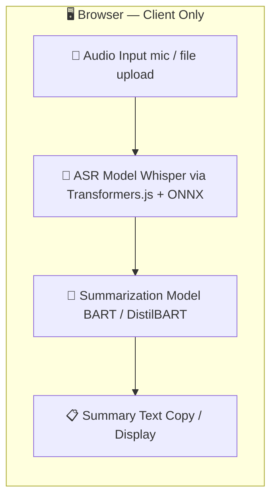

# 🎙️ Voice Notes Summarizer

> Record or upload audio and get instant AI-powered summaries — entirely in your browser. No server. No API keys. No setup.

[](https://voice-note-summarizer-cbabd5.gitlab.io/)
[](https://developer.mozilla.org/en-US/docs/Web/JavaScript)
[](https://huggingface.co/docs/transformers.js)
[](https://getbootstrap.com)
[](https://caniuse.com)

---

## 📖 Table of Contents

- [What It Does](#-what-it-does)
- [Why It's Cool](#-why-its-cool)
- [Key Features](#-key-features)
- [AI Pipeline](#-ai-pipeline)
- [Tech Stack](#-tech-stack)
- [How to Run](#-how-to-run)
  - [Option A — Open Directly (Zero Setup)](#option-a--open-directly-zero-setup)
  - [Option B — Serve Locally](#option-b--serve-locally)
- [Deploy](#-deploy)
- [CI/CD — GitHub Pages](#-cicd--github-pages)
- [CI/CD — GitLab Pages](#-cicd--gitlab-pages)
- [GitHub vs GitLab Comparison](#-github-vs-gitlab-comparison)
- [Project Structure](#-project-structure)
- [Browser Compatibility](#-browser-compatibility)

---

## 🧠 What It Does

Voice Notes Summarizer is a **lightweight, fully browser-based application** that lets you:

1. **Record** voice notes directly in the browser via microphone
2. **Or upload** pre-recorded audio files (mp3, wav, webm, ogg, m4a, and more)
3. **Transcribe** the audio using a state-of-the-art ASR (Automatic Speech Recognition) model
4. **Summarize** the transcript into a concise, readable summary

Everything — the AI models, the inference, the processing — runs **entirely on the client side** using [Xenova/Transformers.js](https://huggingface.co/docs/transformers.js). No data ever leaves your device.

---

## 🌟 Why It's Cool

This project demonstrates a **complete AI pipeline running 100% in-browser**:

```
🎤 Voice Input  →  📝 Transcription (ASR)  →  📄 Summarization (NLP)  →  📋 Copy & Share
```

It's a portfolio-grade showcase of:

- Real-time AI inference without a backend
- WebRTC microphone access and MediaRecorder API
- HuggingFace Transformers running via WebAssembly/ONNX in the browser
- Responsive, accessible UI built with vanilla tooling

No subscriptions. No cloud bills. No data leaks. Just AI in the browser.

---

## ✨ Key Features

| Feature | Description |
|---|---|
| 🎙️ **In-Browser Recording** | Record voice notes directly via microphone using the Web Audio API |
| 📂 **Audio Upload** | Upload mp3, wav, webm, ogg, m4a and other popular formats |
| 🧠 **Smart Summarization** | Switch between a **fast** (lighter) and **accurate** (larger) summarization model |
| 🔊 **Real-Time Feedback** | Blinking recording indicator, live waveform cues, and a modern audio player |
| 🌐 **Multilingual Support** | Summarization models support multiple languages out of the box |
| 🖥️ **Fully Client-Side** | Zero server, zero API keys — complete privacy and offline capability |
| 📋 **Copy Summaries** | One-click copy to clipboard for easy sharing or note-taking |
| 📱 **Responsive Layout** | Works on desktop and mobile browsers |

---

## 🔬 AI Pipeline



**Models used (loaded via Xenova/Transformers.js):**

| Task | Model | Speed |
|---|---|---|
| Speech-to-Text | `Xenova/whisper-tiny.en` | ⚡ Fast |
| Speech-to-Text | `Xenova/whisper-base` | 🎯 Accurate |
| Summarization | `Xenova/distilbart-cnn-6-6` | ⚡ Fast |
| Summarization | `Xenova/bart-large-cnn` | 🎯 Accurate |

Models are fetched from HuggingFace CDN on first use and **cached in the browser** — subsequent runs are instant.

---

## 🛠 Tech Stack

| Layer | Technology |
|---|---|
| **Language** | Vanilla JavaScript (ES6+) |
| **AI / ML** | [Xenova/Transformers.js](https://github.com/xenova/transformers.js) — ONNX models in-browser |
| **UI Framework** | Bootstrap 5 |
| **Audio APIs** | Web Audio API, MediaRecorder API |
| **Deployment** | GitHub Pages / GitLab Pages |
| **CI/CD** | GitHub Actions / GitLab CI |

---

## 🚀 How to Run

Because this is a **fully client-side app**, there is no backend to configure, no `.env` file, and no API keys to manage.

### Option A — Open Directly (Zero Setup)

If your browser supports ES Modules (all modern browsers do), you can simply:

```bash
# Clone the repo
git clone https://github.com/your-username/voice-notes-summarizer.git
cd voice-notes-summarizer

# Open in browser
open index.html
# or on Linux:
xdg-open index.html
# or on Windows:
start index.html
```

> ⚠️ **Note:** Some browsers block microphone access and Web Workers on `file://` URLs. If recording doesn't work, use Option B below.

---

### Option B — Serve Locally

Serving over `http://localhost` avoids browser security restrictions on `file://` and is recommended for the full experience.

**Using Node.js:**

```bash
# Install a simple static server
npm install -g serve

# Serve the project
serve .

# App is live at http://localhost:3000
```

**Using Python:**

```bash
# Python 3
python -m http.server 8080

# App is live at http://localhost:8080
```

**Using VS Code:**

Install the [Live Server](https://marketplace.visualstudio.com/items?itemName=ritwickdey.LiveServer) extension, right-click `index.html` → **Open with Live Server**.

---

### First Load — Model Download

On first use, Transformers.js will download the AI models from HuggingFace CDN and cache them in your browser's IndexedDB. This happens once per model:

| Model | Size | Time (estimate) |
|---|---|---|
| Whisper Tiny | ~75 MB | ~10–20s on broadband |
| Whisper Base | ~145 MB | ~20–40s on broadband |
| DistilBART CNN | ~220 MB | ~30–60s on broadband |
| BART Large CNN | ~560 MB | ~60–120s on broadband |

After the first download, models load from cache in **2–5 seconds**.

---

## ☁️ Deploy

Since this is a static site (pure HTML/CSS/JS), it can be deployed to any static hosting platform with zero configuration.

### GitHub Pages (Free)

Push to your repository and enable GitHub Pages:

1. Go to **Settings → Pages**
2. Under **Source**, select **GitHub Actions** (see CI/CD section below)
3. Push to `main` — the workflow handles the rest

Your site will be live at: `https://your-username.github.io/voice-notes-summarizer/`

### GitLab Pages (Free)

Push to your repository with a `.gitlab-ci.yml` (see CI/CD section below). GitLab Pages will serve the site at:
`https://your-username.gitlab.io/voice-notes-summarizer/`

### Other Platforms

| Platform | Command / Method |
|---|---|
| **Netlify** | Drag & drop the project folder at netlify.com/drop |
| **Vercel** | `npx vercel` in the project directory |
| **Cloudflare Pages** | Connect repo in dashboard, set build output to `/` |
| **Surge.sh** | `npx surge .` |

---

## 🐙 CI/CD — GitHub Pages

Add the following workflow file to your repository. It automatically tests and deploys your static site to GitHub Pages on every push to `main`.

### Step 1 — Create the workflow file

Create `.github/workflows/deploy.yml`:

```yaml
# .github/workflows/deploy.yml
name: Deploy Voice Notes Summarizer to GitHub Pages

on:
  push:
    branches:
      - main              # Deploy on every push to main
  pull_request:
    branches:
      - main              # Run tests on pull requests (no deploy)
  workflow_dispatch:      # Allow manual trigger from GitHub UI

permissions:
  contents: read
  pages: write
  id-token: write

concurrency:
  group: "pages"
  cancel-in-progress: false

jobs:

  # ── Job 1: Lint & Validate ─────────────────────────────
  lint:
    name: Lint & Validate
    runs-on: ubuntu-latest
    steps:
      - name: Checkout repository
        uses: actions/checkout@v4

      - name: Set up Node.js
        uses: actions/setup-node@v4
        with:
          node-version: "20"

      - name: Install dev dependencies (if any)
        run: |
          if [ -f package.json ]; then npm ci; fi

      - name: Validate HTML
        run: |
          npx --yes html-validate index.html || echo "HTML validation complete"

  # ── Job 2: Build ───────────────────────────────────────
  build:
    name: Build Static Site
    runs-on: ubuntu-latest
    needs: lint
    steps:
      - name: Checkout repository
        uses: actions/checkout@v4

      - name: Set up Node.js
        uses: actions/setup-node@v4
        with:
          node-version: "20"

      - name: Install dependencies (if any)
        run: |
          if [ -f package.json ]; then npm ci; fi

      - name: Prepare static files
        run: |
          # If you have a build step (e.g. bundler), run it here.
          # For pure static sites, just confirm key files exist.
          echo "Checking required files..."
          test -f index.html && echo "✅ index.html found"

      - name: Upload Pages artifact
        uses: actions/upload-pages-artifact@v3
        with:
          path: .          # Serve from project root (change to ./dist if you use a bundler)

  # ── Job 3: Deploy ──────────────────────────────────────
  deploy:
    name: Deploy to GitHub Pages
    runs-on: ubuntu-latest
    needs: build
    if: github.ref == 'refs/heads/main'   # Only deploy on main branch pushes
    environment:
      name: github-pages
      url: ${{ steps.deployment.outputs.page_url }}
    steps:
      - name: Deploy to GitHub Pages
        id: deployment
        uses: actions/deploy-pages@v4
```

### Step 2 — Enable GitHub Pages

1. Go to your repository → **Settings → Pages**
2. Under **Source**, choose **GitHub Actions**
3. Save — no further config needed

### Step 3 — Push and watch it deploy

```bash
git add .github/workflows/deploy.yml
git commit -m "ci: add GitHub Pages deployment workflow"
git push origin main
```

Go to the **Actions** tab in your repository to watch the pipeline run live. Your site will be available at `https://your-username.github.io/voice-notes-summarizer/` within a minute or two.

---

## 🦊 CI/CD — GitLab Pages

If you're hosting on GitLab, add the following `.gitlab-ci.yml` to the project root:

```yaml
# .gitlab-ci.yml
stages:
  - validate
  - build
  - deploy

variables:
  NODE_VERSION: "20"

validate:
  stage: validate
  image: node:20-alpine
  script:
    - echo "Validating project structure..."
    - test -f index.html && echo "✅ index.html found"
    - echo "Validation passed."
  only:
    - main
    - merge_requests

build:
  stage: build
  image: node:20-alpine
  script:
    - echo "Preparing static files for deployment..."
    - mkdir -p public
    - cp -r . public/
    - rm -rf public/.git public/.gitlab-ci.yml
    - echo "Build complete."
  artifacts:
    paths:
      - public/
    expire_in: 1 hour
  only:
    - main

pages:
  stage: deploy
  script:
    - echo "Deploying to GitLab Pages..."
  artifacts:
    paths:
      - public/
  only:
    - main
  environment:
    name: production
    url: https://$CI_PROJECT_NAMESPACE.gitlab.io/$CI_PROJECT_NAME
```

> The `public/` directory is the magic key — GitLab Pages always serves from `public/`.

---

## 📊 GitHub vs GitLab Comparison

| | GitHub Actions | GitLab CI/CD |
|---|---|---|
| **Workflow file** | `.github/workflows/deploy.yml` | `.gitlab-ci.yml` |
| **Pages folder** | Configurable (set in `path:`) | Must be `public/` |
| **Enable Pages** | Settings → Pages → GitHub Actions | Automatic after `pages` job runs |
| **Secrets** | Settings → Secrets → Actions | Settings → CI/CD → Variables |
| **Manual trigger** | Actions tab → Run workflow | CI/CD → Pipelines → Run pipeline |
| **Free CI minutes** | 2,000 min/month | 400 min/month |
| **Deploy preview** | Needs extra config | Environments tab |
| **Static site URL** | `username.github.io/repo` | `username.gitlab.io/repo` |

---

## 🌍 Browser Compatibility

| Browser | Recording | Upload | AI Inference |
|---|---|---|---|
| Chrome 90+ | ✅ | ✅ | ✅ |
| Edge 90+ | ✅ | ✅ | ✅ |
| Firefox 90+ | ✅ | ✅ | ✅ |
| Safari 15+ | ⚠️ Limited | ✅ | ✅ |
| Mobile Chrome | ✅ | ✅ | ⚠️ Slow on low-end devices |

> ⚠️ Safari has partial MediaRecorder support. Audio upload works fully on all browsers.

---

## 🤝 Contributing

Contributions, issues, and feature requests are welcome!

1. Fork the repository
2. Create your feature branch: `git checkout -b feat/amazing-feature`
3. Commit your changes: `git commit -m 'feat: add amazing feature'`
4. Push to the branch: `git push origin feat/amazing-feature`
5. Open a Pull Request

---

## 📄 License

MIT © Voice Notes Summarizer Contributors

---

> Built with 🎙️ + 🧠 using Vanilla JS, Transformers.js, and Bootstrap — no backend required.
